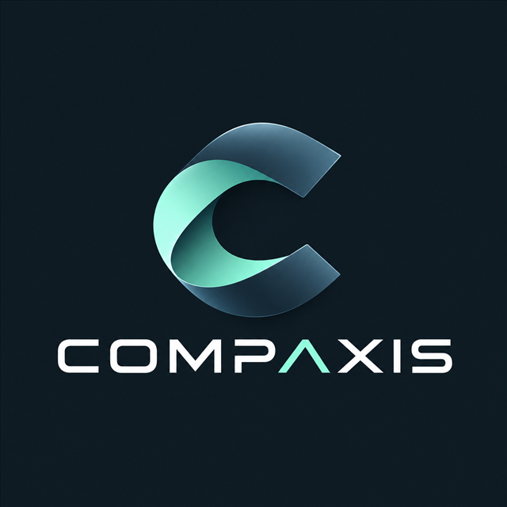

<p align="center">
  
</p>

<h1 align="center">Compaxis</h1>

<p align="center">
  EuroLeague scouting, player comparison, and performance analytics.
</p>

## Overview

Compaxis brings player statistics, team data, standings, and season-aware
comparisons into one application. Every primary view follows the globally
selected EuroLeague season without requiring a page reload.

## Features

- Multi-season Overview dashboard
- Player leaderboard and season profiles
- Team directory and season rosters
- EuroLeague standings
- Side-by-side player comparison
- Structured, data-grounded scouting analysis
- Transactional player, team, statistics, and standings imports
- Responsive light and dark interface

## Long-term vision

The project can evolve into a broader scouting assistant capable of:

- Similar player search
- Natural language questions
- Scouting reports
- Cross-season comparisons
- Team analysis
- Internal data tools

## Tech stack

Backend:

- Python
- FastAPI
- SQLAlchemy
- Alembic
- PostgreSQL
- Docker
- uv

Frontend:

- Next.js
- TypeScript
- Material UI

Analysis:

- OpenAI Responses API
- Structured Outputs

## Architecture

```text
Next.js
    |
FastAPI
    |
Service
    |
Repository
    |
SQLAlchemy
    |
PostgreSQL
```

## Data source

Unofficial EuroLeague API.

## Local development

Copy the example environment files and set an OpenAI key/model when Scout
analysis is needed:

```powershell
Copy-Item backend/.env.example backend/.env
Copy-Item frontend/.env.example frontend/.env.local
```

Start PostgreSQL and run the applications in separate terminals:

```powershell
docker compose up -d postgres
cd backend
uv run uvicorn euroscout.main:app --reload
```

```powershell
cd frontend
npm install
npm run dev
```

Alternatively, build and run the complete stack:

```powershell
docker compose up --build
```

## Data imports

Import player statistics, teams, and standings in one transaction by providing
the season starting year and standings round:

```powershell
cd backend
uv run python -m euroscout.scripts.import_full_season 2025 38
```

The command is idempotent and rolls back the whole import if either source fails.

## Quality checks

```powershell
cd backend
uv run ruff check src tests
uv run python -m unittest discover -s tests
```

```powershell
cd frontend
npm run lint
npm test
npx tsc --noEmit
npm run build
```

The Playwright smoke test expects the API and database to be running:

```powershell
cd frontend
npx playwright install chromium
npm run test:e2e
```
